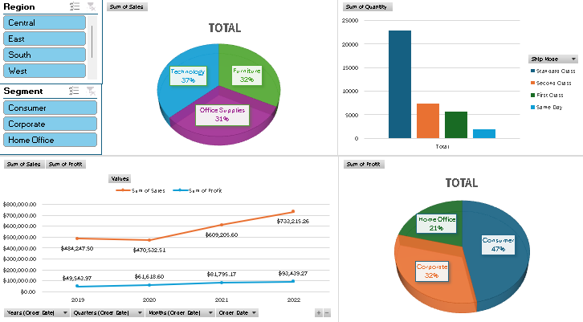

# Sales Performance Dashboard

## Overview

This project is an end-to-end data analysis of a large superstore dataset, built entirely within Microsoft Excel. The goal was to transform nearly 10,000 rows of raw transactional data into an interactive and insightful dashboard. It serves as a practical demonstration of advanced Excel capabilities for data analysis, financial reporting, and business intelligence.

---
## Dashboard Preview
 

---

## Skills and Competencies Demonstrated

This project showcases a strong command of the following skills:

### **Advanced Excel Functions**
* **Data Integration (XLOOKUP):** Used the modern `XLOOKUP` function to dynamically merge data from a separate worksheet (Regional Managers) into the main sales table, demonstrating the ability to join and enrich datasets. This is a direct application of advanced lookup capabilities, surpassing the traditional `VLOOKUP`.

### **Data Analysis and Tools**
* **Pivot Tables & Pivot Charts:** Leveraged Pivot Tables as the core analytical tool to aggregate and summarize vast amounts of data instantly. Created multiple reports to analyze performance by product category and time-series trends (year-over-year and quarterly).
* **Interactive Dashboards:** Transformed the static analysis into a dynamic dashboard by creating Pivot Charts and integrating **Slicers**. This allows end-users to easily filter the entire report by variables like `Region` and `Customer Segment`.

### **Mathematical & Financial Analysis**
* **Calculated Columns & Feature Engineering:** Demonstrated strong analytical skills by creating new calculated columns from existing data. Specifically, I derived `Unit Price` and `Profit Margin` for each transaction to enable deeper financial analysis.
* **Handling Financial Data:** The entire project centered on key financial metrics like `Sales`, `Profit`, and `Discount`. The analysis provided direct insights into profitability, revenue drivers, and financial performance over time.

---

## Project Phases

The project was executed in a structured, five-phase process:

1.  **Data Structuring and Cleaning:**
    * Imported raw CSV data.
    * Formatted the data as an official **Excel Table** for dynamic management.
    * Verified and corrected data types for dates, currency, and percentages.

2.  **Data Enrichment:**
    * Added calculated columns for **Unit Price** and **Profit Margin** to enhance the analytical depth of the dataset.

3.  **Data Integration:**
    * Created a secondary data table for Regional Managers.
    * Used **XLOOKUP** to integrate this information into the main `SalesData` table.

4.  **Core Analysis with Pivot Tables:**
    * Built Pivot Tables to aggregate data and answer key business questions regarding sales performance by category and profitability trends over time.

5.  **Dashboard Visualization:**
    * Converted analytical tables into **Pivot Charts** (Bar and Line charts).
    * Assembled the charts onto a final `Dashboard` sheet.
    * Added and connected **Slicers** to create a fully interactive user experience.

---

## Tools & Dataset

* **Tool:** Microsoft Excel
* **Dataset:** [Superstore Sales Dataset](https://github.com/WuCandice/Superstore-Sales-Analysis/blob/main/dataset/Superstore%20Dataset.csv) - A publicly available dataset containing sales transactions.
